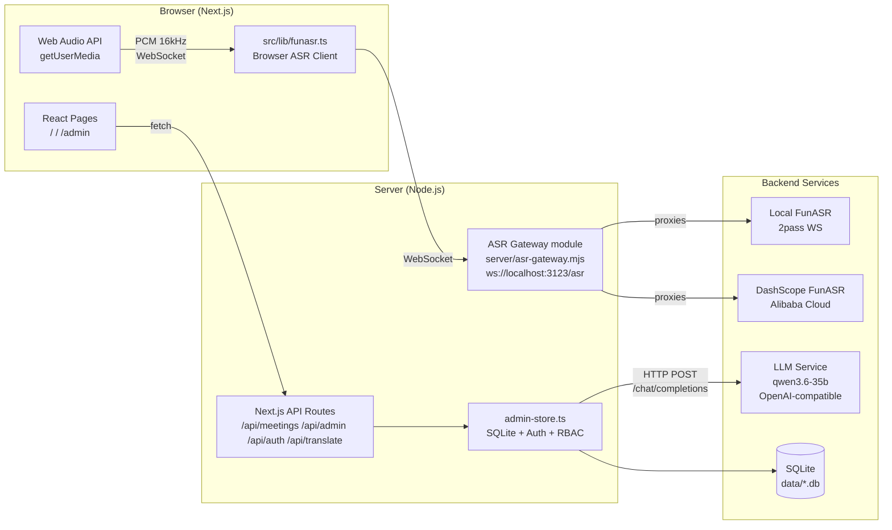

# Smart Meeting Minutes System

> [中文版](./README_CN.md)

A full-stack smart meeting minutes system based on Next.js, featuring real-time recording transcription, LLM-powered minutes generation, real-time translation, email delivery, and admin configuration management.

---

## Features

- **Recording & Transcription** — Browser microphone recording (including multiple mic devices) or system-sound capture and audio file upload, relayed through an ASR Gateway to FunASR (local deployment or DashScope cloud), with speaker clustering and **ASR language selection** (auto / zh / en / ja / ko / yue)
- **Dual-Channel ASR** — Capture from mic and system speaker simultaneously; each channel runs its own ASR session, with source (`mic`/`speaker`) and per-device segments kept separate
- **Minutes Generation** — Automatic structured meeting minutes via an OpenAI-compatible API (e.g. `qwen3.6-35b`), supporting multiple templates and versions
- **Real-Time Translation** — Live transcript is auto-translated to a target language (buffered, batch-triggered); history transcripts and arbitrary selected text can also be translated; translations are persisted as versioned LLM results
- **Text-to-Speech** — Read the transcript/minutes or any selected text aloud via the browser Web Speech API
- **History Records** — Meeting list with transcript viewing, minutes/translation preview, and regeneration
- **Email Delivery** — Send meeting minutes via SMTP to specified recipients with CC, custom subject/signature, and send audit logs
- **Admin Panel** — ASR config, LLM config, email config, prompt template management, hotword management, user & role management (RBAC), audit logs, connection tests

> Task/action-item tracking is out of scope for this product. If needed later, it should be developed as a standalone product consuming the transcripts or minutes produced by this system.

## Architecture



## Tech Stack

| Category | Technology | Version | Notes |
|:---|:---|:---|:---|
| Framework | Next.js (App Router) | 15 | Frontend pages + API Routes |
| Language | TypeScript | 5.x | Type-safe |
| UI | Tailwind CSS | 3.x | Utility-first CSS |
| Database | SQLite (`node:sqlite`) | built-in | Zero-dependency local DB |
| State | Zustand | 4.x | Lightweight |
| ASR Gateway | WebSocket (`ws`) | 8.x | Browser ↔ ASR relay |
| Mail | Nodemailer | 9.x | SMTP delivery |
| LLM | OpenAI-compatible API | — | e.g. `qwen3.6-35b` |
| TTS | Web Speech API | built-in | Read transcript/minutes aloud |

## Quick Start

### 1. Install

```bash
npm install
```

### 2. Start Dev Server

```bash
npm run dev
```

`npm run dev` starts a single unified server (`server/app-server.mjs`) that hosts both:
- Next.js: app + API Routes (port 3123)
- ASR Gateway: `server/asr-gateway.mjs` (WebSocket module mounted at `/asr`)

Open http://localhost:3123 to use the app.

Open http://localhost:3123/admin for the admin panel.

### 3. Configuration

All sensitive configuration is stored in the local SQLite database via the admin panel and is **not** exposed in frontend code:

- **ASR**: Provider type (local_funasr / dashscope), endpoint address, API Key, Workspace ID
- **LLM**: Base URL (OpenAI-compatible), API Key, model name, context size, max tokens, timeout, global concurrency/queue capacity, translate trigger sentence count, thinking-model toggle
- **Mail**: SMTP host/port/username/password, sender name, default subject template, default signature
- **Prompt Templates**: Default minutes template (customizable, supports `{transcript}` placeholder) plus a built-in system translation template
- **Hotwords**: ASR hotword list with weights and enable/disable

### 4. Default Account

A bootstrap admin is created automatically on first startup:

- Account: `admin` (configurable via `BOOTSTRAP_ADMIN_ACCOUNT`)
- Password: `admin123` (set `BOOTSTRAP_ADMIN_PASSWORD` in production)

In dev mode, set `DEV_ACTOR_ACCOUNT` to skip login.

## Project Structure

```text
src/
├── app/
│   ├── page.tsx                 # Main page: recording, history, transcript, minutes & translation
│   ├── layout.tsx               # Root layout
│   ├── login/                   # Login page
│   ├── change-password/         # Change password page
│   ├── admin/
│   │   └── page.tsx             # Admin panel
│   └── api/
│       ├── config/              # Runtime config (non-sensitive)
│       ├── meetings/            # Meeting CRUD, ASR/LLM results, live translation, email send
│       ├── translate/           # Batch sentence translation
│       ├── translate-selection/ # Arbitrary selected-text translation
│       ├── llm-queue-status/    # Global LLM queue status (in-flight/queued/dropped)
│       ├── admin/               # Admin config (settings/hotwords/prompt-templates/users/roles/audit-logs/test-*)
│       └── auth/                # Login/logout/session
├── components/
│   ├── main/                    # Recording controls, device selector, history list, transcript view, translation view, hotword manager, markdown preview, ASR result detail
│   ├── tts/                     # TtsProvider (Web Speech API) + readable-text sync
│   └── layout/                  # AppHeader
├── lib/
│   ├── admin-store.ts           # SQLite operations, config, meetings, translation, audit, minimal RBAC + auth
│   ├── llm-queue.ts             # Global LLM queue (concurrency + capacity control)
│   ├── api-auth.ts              # API role guard middleware
│   ├── auth-constants.ts        # Session cookie constant
│   ├── funasr.ts                # Browser-side ASR client (WebSocket → ASR Gateway, multi-channel)
│   ├── voiceprint.ts            # Voiceprint feature extraction & speaker clustering
│   ├── transcript-state.ts      # Multi-channel transcript state machine
│   ├── use-auth-session.ts      # Session loading hook
│   ├── meeting-status.ts        # Meeting status enumeration
│   ├── store-utils.ts           # General storage utilities
│   └── mockData.ts              # Demo mock data
└── types/
    └── index.ts                 # TypeScript type definitions

server/
├── app-server.mjs               # Unified HTTP/WS server entry (Next.js + ASR Gateway + cleanup timers)
├── asr-gateway.mjs              # ASR Gateway (WebSocket server, multi-provider adapter)
├── database-schema.mjs          # SQLite schema (CREATE TABLE)
├── db-shared.mjs                # Shared DB helpers (audit-log cleanup)
└── runtime-store.mjs            # Gateway runtime config reader + capture session store (SQLite)
```

## Data Storage

Local SQLite database file:

```text
data/meeting-asr-app.db
```

Core tables: `app_settings`, `llm_prompt_templates`, `asr_hotwords`, `users`, `roles`, `user_roles`, `auth_sessions`, `meetings`, `meeting_asr_results`, `meeting_llm_results`, `meeting_send_records`, `asr_capture_sessions`, `asr_capture_events`, `audit_logs`

## Core Flow

```text
Recording/Upload → ASR Gateway → FunASR Transcription → (Live Translation) → LLM Minutes → Email Delivery
```

### ASR Gateway

The ASR Gateway (`server/asr-gateway.mjs`) is the unified proxy layer between browser and ASR services:

- Accepts browser WebSocket connections at the same server's `/asr` path
- Auto-selects provider adapter based on `app_settings.asr.provider` setting
- Supports **Local FunASR** (2pass WebSocket protocol) and **DashScope FunASR** (Alibaba Cloud)
- Passes through the ASR language (`svs_lang`) session parameter; strips SenseVoice tags (`<|lang|><|emotion|><|event|>`) at the gateway layer
- Records all raw ASR events to `asr_capture_sessions` / `asr_capture_events` for audit and debugging
- Enforces Origin whitelist (default: `localhost:3123`)
- Requires a valid login session cookie during the WebSocket handshake in production; expired, password-change-required, or non-business-role sessions are rejected
- Development mode may use `DEV_ACTOR_ACCOUNT`, matching the HTTP API development fallback
- Buffers PCM audio until ASR session is ready

### Dual-Channel ASR & Speaker Clustering

- Multiple capture channels: one `FunASRClient` + one gateway session per mic `deviceId`, plus a `speaker` channel for system sound; segments are tagged with `source` (`mic`/`speaker`) and `deviceId`
- Browser-side `voiceprint.ts` performs speaker clustering per channel (RMS, F0, spectral features → cosine similarity + threshold clustering), complementing or falling back from FunASR speaker labels

### Translation

- **Live**: final transcript sentences are buffered and batch-translated via `/api/translate` (triggered by N sentences or a 10s interval); `elapsedMs` is returned and shown in the UI
- **History**: `/api/meetings/:id/llm-results` regenerates translations for saved transcripts, persisted as versioned `result_type='translation'` rows
- **Selection**: arbitrary selected text can be translated via `/api/translate-selection`
- All LLM calls (translation, minutes, tests) flow through the global queue (`src/lib/llm-queue.ts`) with configurable concurrency/capacity and type-specific wait timeouts

### RBAC Roles

| Role | Permissions |
|:---|:---|
| `user` | Create/view meetings, generate minutes, translate, send emails |
| `system_admin` | All + manage prompt templates, hotwords, ASR/LLM/mail config, users & roles, audit logs, connection tests |

### Text-to-Speech

`src/components/tts/TtsProvider.tsx` wraps the browser Web Speech API: read the transcript/minutes or any selected text aloud, with Chinese voice preference.

## Environment Variables

| Variable | Description | Default |
|:---|:---|:---|
| `PORT` | Unified application server port | `3123` |
| `APP_HOST` | Unified application server listen address | `0.0.0.0` |
| `ASR_GATEWAY_PATH` | ASR Gateway WebSocket path | `/asr` |
| `ASR_GATEWAY_ALLOWED_ORIGINS` | Allowed WebSocket origins (comma-separated) | `http://localhost:3123,...` |
| `BOOTSTRAP_ADMIN_ACCOUNT` | Bootstrap admin account name | `admin` |
| `BOOTSTRAP_ADMIN_PASSWORD` | Bootstrap admin password | `admin123` (dev only) |
| `DEV_ACTOR_ACCOUNT` | Dev mode auto-login account | — |

## Scripts

| Command | Description |
|:---|:---|
| `npm run dev` | Start the unified Next.js + ASR server in development |
| `npm run build` | Production build |
| `npm start` | Start the unified production server (port 3123) |
| `npm run lint` | Lint check |
| `npm run probe:service` | Probe ASR service connectivity (TCP/HTTP/WS) |

## Pages

| Route | Description |
|:---|:---|
| `/` | Main page: device selection (mic + speaker), ASR language, recording, live transcript, live/history/selection translation, minutes, email, TTS |
| `/login` | Login page |
| `/change-password` | Change password page |
| `/admin` | Admin panel: ASR/LLM/Mail config, prompts, hotwords, users & roles, audit logs, LLM queue status |

## Docs

| Doc | Description |
|:---|:---|
| [Deployment Guide](./docs/deployment-guide.md) | Production deployment of this app (compose + .env + backup) |
| [FunASR Deployment Guide](./docs/funasr-deployment.md) | Self-hosted FunASR online service setup & integration |
| [FunASR Models](./docs/funasr-models.md) | FunASR model selection & language capability guide |
| [Voiceprint Deployment](./docs/funasr-voiceprint-deployment.md) | Server-side voiceprint (CAM++) container deployment & ops |
| [English Meeting Support](./docs/english-meeting-support.md) | Switch to English meetings: ASR + voiceprint + minutes template |
| [FunASR Migration](./docs/funasr-migration.md) | DashScope → local FunASR adaptation notes |
| [Nginx Config Sample](./docs/nginx-meeting-asr.conf) | Reverse-proxy config for the app / ASR WebSocket |
| [Technical Design](./docs/technical-design.md) | Architecture & module design |
| [UI Interaction Design](./docs/ui-interaction-design.md) | Pages & interaction design |
| [Auth Productization](./docs/auth-productization.md) | Auth & permission productization |
| [Design Docs](./docs/design/) | ADRs: data flow, dual-channel ASR, LLM pipeline, LLM queue & translation, tenant isolation, perf & storage, server-side voiceprint (CAM++) |

---

✌Bazinga！
