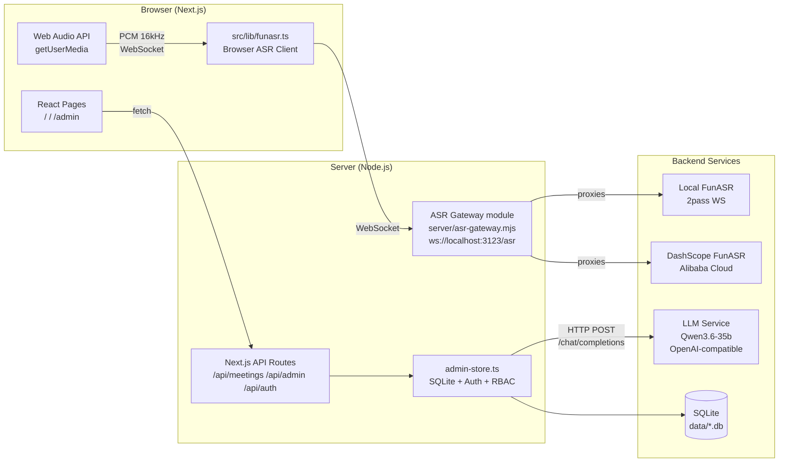

# Smart Meeting Minutes System

> [中文版](./README_CN.md)

A full-stack smart meeting minutes system based on Next.js, featuring real-time recording transcription, LLM-powered minutes generation, email delivery, and admin configuration management.

---

## Features

- **Recording & Transcription** — Browser microphone recording or audio file upload, using ASR Gateway to relay to FunASR (local deployment or DashScope cloud), with speaker diarization
- **Minutes Generation** — Automatic structured meeting minutes via OpenAI-compatible API (Qwen3.6-35b), supporting multiple templates and versions
- **History Records** — Meeting list with transcript viewing, minutes preview, and regeneration
- **Email Delivery** — Send meeting minutes via SMTP to specified recipients with CC, custom subject/signature, and send audit logs
- **Admin Panel** — ASR config, LLM config, email config, prompt template management, hotword management, user & role management (RBAC), audit logs

> Task/action-item tracking is out of scope for this product. If needed later, it should be developed as a standalone product consuming the transcripts or minutes produced by this system.

## Architecture



## Tech Stack

| Category | Technology | Version | Notes |
|:---|:---|:---|:---|
| Framework | Next.js (App Router) | 14+ | Frontend pages + API Routes |
| Language | TypeScript | 5.x | Type-safe |
| UI | Tailwind CSS | 3.x | Utility-first CSS |
| Database | SQLite (`node:sqlite`) | built-in | Zero-dependency local DB |
| State | Zustand | 4.x | Lightweight |
| ASR Gateway | WebSocket (`ws`) | 8.x | Browser ↔ ASR relay |
| Mail | Nodemailer | 9.x | SMTP delivery |
| LLM | OpenAI-compatible API | — | Qwen3.6-35b |

## Quick Start

### 1. Install

```bash
npm install
```

### 2. Start Dev Server

```bash
npm run dev
```

`npm run dev` starts both:
- ASR Gateway: `server/asr-gateway.mjs` (WebSocket module mounted at `/asr`)
- Next.js: dev server (port 3123)

Open http://localhost:3123 to use the app.

Open http://localhost:3123/admin for the admin panel.

### 3. Configuration

All sensitive configuration is stored in the local SQLite database via the admin panel and is **not** exposed in frontend code:

- **ASR**: Provider type (local_funasr / dashscope), endpoint address, API Key, Workspace ID
- **LLM**: Base URL (OpenAI-compatible), API Key, model name
- **Mail**: SMTP host/port/username/password, sender name, default subject template, default signature
- **Prompt Templates**: Default minutes template (customizable, supports `{transcript}` placeholder)
- **Hotwords**: ASR hotword list with weights and enable/disable

### 4. Default Account

A bootstrap admin is created automatically on first startup:

- Account: `admin` (configurable via `BOOTSTRAP_ADMIN_ACCOUNT`)
- Password: `admin123` (set `BOOTSTRAP_ADMIN_PASSWORD` in production)

In dev mode, set `DEV_ACTOR_ACCOUNT` to skip login.

## Project Structure

```text
src/
├── app/
│   ├── page.tsx                 # Main page: recording, history, transcript & minutes
│   ├── layout.tsx               # Root layout
│   ├── login/                   # Login page
│   ├── change-password/         # Change password page
│   ├── admin/
│   │   └── page.tsx             # Admin panel
│   └── api/
│       ├── config/              # Runtime config
│       ├── meetings/            # Meeting CRUD, ASR, LLM, email send
│       ├── summarize/           # Legacy minutes generation endpoint
│       ├── admin/               # Admin config (settings/hotwords/prompt-templates/users/roles/audit-logs/test-*)
│       └── auth/                # Login/logout/session
├── components/
│   ├── main/                    # Recording controls, device selector, history list, transcript view, hotword manager, markdown preview
│   └── layout/                  # AppHeader
├── lib/
│   ├── admin-store.ts           # SQLite operations, config, meetings, audit, minimal RBAC + auth
│   ├── api-auth.ts              # API role guard middleware
│   ├── auth-constants.ts        # Session cookie constant
│   ├── funasr.ts                # Browser-side ASR client (WebSocket → ASR Gateway)
│   ├── voiceprint.ts            # Voiceprint feature extraction & speaker clustering
│   ├── meeting-status.ts        # Meeting status enumeration
│   ├── store-utils.ts           # General storage utilities
│   └── mockData.ts              # Demo mock data
└── types/
    └── index.ts                 # TypeScript type definitions

server/
├── asr-gateway.mjs              # ASR Gateway (WebSocket server, multi-provider adapter)
└── runtime-store.mjs            # Gateway runtime config reader (SQLite)
```

## Data Storage

Local SQLite database file:

```text
data/meeting-asr-app.db
```

Core tables: `app_settings`, `llm_prompt_templates`, `asr_hotwords`, `meetings`, `meeting_asr_results`, `meeting_llm_results`, `meeting_send_records`, `asr_capture_sessions`, `users`, `roles`, `user_roles`, `audit_logs`, `auth_sessions`

## Core Flow

```text
Recording/Upload → ASR Gateway → FunASR Transcription → LLM Minutes → Email Delivery
```

### ASR Gateway

The ASR Gateway (`server/asr-gateway.mjs`) is the unified proxy layer between browser and ASR services:

- Accepts browser WebSocket connections at the same server's `/asr` path
- Auto-selects provider adapter based on `app_settings.asr.provider` setting
- Supports **Local FunASR** (2pass WebSocket protocol) and **DashScope FunASR** (Alibaba Cloud)
- Records all raw ASR events to `asr_capture_sessions` for audit and debugging
- Enforces Origin whitelist (default: `localhost:3123`)
- Requires a valid login session cookie during the WebSocket handshake in production; expired, password-change-required, or non-business-role sessions are rejected
- Development mode may use `DEV_ACTOR_ACCOUNT`, matching the HTTP API development fallback
- Buffers PCM audio until ASR session is ready

### RBAC Roles

| Role | Permissions |
|:---|:---|
| `user` | Create/view meetings, generate minutes, send emails |
| `system_admin` | All + manage prompt templates, hotwords, ASR/LLM/mail config, users & roles, audit logs, connection tests |

### Voiceprint Clustering

Browser-side `voiceprint.ts` performs speaker clustering:

- Extracts 12-dimensional voiceprint features (RMS, F0, spectral centroid/bandwidth/rolloff/flatness/flux)
- Computes F0 via autocorrelation method
- Uses Web Audio API → custom FFT (Cooley-Tukey)
- Cosine similarity + threshold clustering (default threshold: 0.6)
- Complements or falls back from FunASR CAM++ speaker labels

## Environment Variables

| Variable | Description | Default |
|:---|:---|:---|
| `PORT` | Unified application server port | `3123` |
| `APP_HOST` | Unified application server listen address | `0.0.0.0` |
| `ASR_GATEWAY_PATH` | ASR Gateway WebSocket path | `/asr` |
| `ASR_GATEWAY_ALLOWED_ORIGINS` | Allowed WebSocket origins (comma-separated) | `http://localhost:3123,...` |
| `BOOTSTRAP_ADMIN_ACCOUNT` | Bootstrap admin account name | `admin` |
| `BOOTSTRAP_ADMIN_PASSWORD` | Bootstrap admin password | `admin123` (dev only) |
| `DEV_ACTOR_ACCOUNT` | Dev mode auto-login account | — |

## Scripts

| Command | Description |
|:---|:---|
| `npm run dev` | Start the unified Next.js + ASR server in development |
| `npm run build` | Production build |
| `npm start` | Start the unified production server (port 3123) |
| `npm run lint` | Lint check |
| `npm run probe:service` | Probe ASR service connectivity (TCP/HTTP/WS) |

## Pages

| Route | Description |
|:---|:---|
| `/` | Main page: device selection, recording, live transcript, history, minutes, email |
| `/login` | Login page |
| `/change-password` | Change password page |
| `/admin` | Admin panel: ASR/LLM/Mail config, prompts, hotwords, users & roles, audit logs |

## Docs

| Doc | Description |
|:---|:---|
| [Deployment Guide](./docs/deployment-guide.md) | Production deployment of this app (compose + .env + backup) |
| [FunASR Deployment Guide](./docs/funasr-deployment.md) | Self-hosted FunASR online service setup & integration |
| [FunASR Migration](./docs/funasr-migration.md) | DashScope → local FunASR adaptation notes |
| [Technical Design](./docs/technical-design.md) | Architecture & module design |
| [UI Interaction Design](./docs/ui-interaction-design.md) | Pages & interaction design |
| [Auth Productization](./docs/auth-productization.md) | Auth & permission productization |
| [Design Docs](./docs/design/) | ADRs: data flow, tenant isolation, perf & storage |

---

✌Bazinga！
