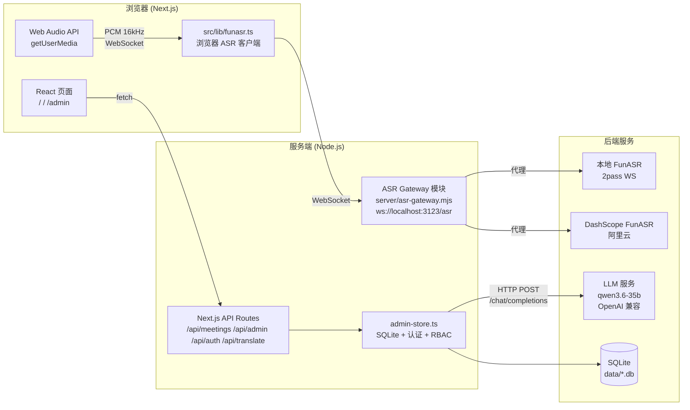

# 智能会议纪要系统

> [English](./README.md)

基于 Next.js 的全栈智能会议纪要系统，支持实时录音转写、LLM 纪要生成、实时翻译、邮件发送和后台配置管理。

---

## 功能特性

- **录音转写** — 浏览器端麦克风录音（支持多个麦克风设备）或系统声音采集、音频文件上传，通过 ASR Gateway 统一接入 FunASR（本地部署或 DashScope 云端），支持说话人聚类与**语种选择**（auto / zh / en / ja / ko / yue）
- **双路采集** — 麦克风与系统声音可同时采集；每路独立 ASR 会话，段按来源（`mic`/`speaker`）与设备 ID 区分
- **纪要生成** — 基于 OpenAI 兼容 API（如 `qwen3.6-35b`）自动生成结构化会议纪要，支持多模板、多版本
- **实时翻译** — 实时转写自动翻译到目标语言（缓存、按句数/时间触发批翻）；历史转写与任意选中文本也可翻译，译文以版本化的 LLM 结果持久化
- **语音朗读** — 通过浏览器 Web Speech API 朗读转写/纪要或任意选中文本
- **历史记录** — 会议记录列表，支持转写文本查看、纪要/译文预览、重新生成
- **邮件发送** — 通过 SMTP 将会议纪要发送给指定收件人，支持抄送、自定义主题/签名，含发送审计日志
- **后台管理** — ASR 配置、LLM 配置、邮件配置、提示词模板管理、热词管理、用户与角色管理（RBAC）、审计日志、连接测试

> 任务/行动项跟踪不属于当前产品范围。如后续需要，应作为独立产品开发，消费本系统输出的转写文本或会议纪要。

## 架构概览



## 技术栈

| 类别 | 技术 | 版本 | 说明 |
|:---|:---|:---|:---|
| 框架 | Next.js (App Router) | 15 | 前端页面 + API Routes |
| 语言 | TypeScript | 5.x | 类型安全 |
| UI 框架 | Tailwind CSS | 3.x | 原子化 CSS |
| 数据库 | SQLite (`node:sqlite`) | built-in | 本地零依赖 |
| 状态管理 | Zustand | 4.x | 轻量级 |
| ASR 网关 | WebSocket (`ws`) | 8.x | 浏览器 ↔ ASR 中转 |
| 邮件 | Nodemailer | 9.x | SMTP 发送 |
| LLM | OpenAI 兼容 API | — | 如 `qwen3.6-35b` |
| 语音朗读 | Web Speech API | 内置 | 朗读转写/纪要 |

## 快速开始

### 1. 安装依赖

```bash
npm install
```

### 2. 启动开发服务

```bash
npm run dev
```

`npm run dev` 启动一个统一的服务（`server/app-server.mjs`），同时托管：
- Next.js: 应用 + API Routes（端口 3123）
- ASR Gateway: `server/asr-gateway.mjs`（挂载在 `/asr` 的 WebSocket 模块）

访问 http://localhost:3123 即可使用。

访问 http://localhost:3123/admin 进入后台管理。

### 3. 配置

所有敏感配置通过后台管理页面保存到本地 SQLite 数据库，**不会**暴露到前端代码中：

- **ASR 服务**: Provider 类型 (local_funasr / dashscope)、Endpoint 地址、API Key、Workspace ID
- **LLM 服务**: Base URL (OpenAI 兼容)、API Key、模型名称、上下文大小、最大 Tokens、超时、全局并发/排队长度、翻译触发句数、是否思考模型
- **邮件服务**: SMTP 主机/端口/用户名/密码、发件人名称、默认主题模板、默认签名
- **提示词模板**: 默认纪要模板（可自定义，支持 `{transcript}` 占位符）+ 内置系统翻译模板
- **热词**: ASR 热词列表，支持权重和启用/禁用

### 4. 默认账号

首次启动时自动创建引导管理员：

- 账号: `admin`（可通过 `BOOTSTRAP_ADMIN_ACCOUNT` 环境变量配置）
- 密码: `admin123`（生产环境请通过 `BOOTSTRAP_ADMIN_PASSWORD` 环境变量设置）

开发环境下可设置 `DEV_ACTOR_ACCOUNT` 跳过登录。

## 项目结构

```text
src/
├── app/
│   ├── page.tsx                 # 主页：录音、历史会议、转写、纪要与翻译
│   ├── layout.tsx               # 根布局
│   ├── login/                   # 登录页
│   ├── change-password/         # 修改密码页
│   ├── admin/
│   │   └── page.tsx             # 管理后台
│   └── api/
│       ├── config/              # 运行配置读取（非敏感）
│       ├── meetings/            # 会议 CRUD、ASR/LLM 结果、实时翻译、邮件发送
│       ├── translate/           # 批量句子翻译
│       ├── translate-selection/ # 任意选中文本翻译
│       ├── llm-queue-status/    # 全局 LLM 队列状态（进行中/排队/丢弃）
│       ├── admin/               # 后台配置管理（settings/hotwords/prompt-templates/users/roles/audit-logs/test-*）
│       └── auth/                # 登录/登出/会话
├── components/
│   ├── main/                    # 录音控件、设备选择、历史列表、转写视图、翻译视图、热词管理、Markdown 预览、ASR 结果详情
│   ├── tts/                     # TtsProvider（Web Speech API）+ 可朗读文本同步
│   └── layout/                  # AppHeader
├── lib/
│   ├── admin-store.ts           # SQLite 数据库操作、配置、会议、翻译、审计、极简 RBAC + 认证
│   ├── llm-queue.ts             # 全局 LLM 队列（并发与容量控制）
│   ├── api-auth.ts              # 后台 API 角色守卫
│   ├── auth-constants.ts        # 会话 Cookie 常量
│   ├── funasr.ts                # 浏览器端 ASR 客户端 (WebSocket → ASR Gateway，多通道)
│   ├── voiceprint.ts            # 声纹特征提取与说话人聚类
│   ├── transcript-state.ts      # 多通道转写状态机
│   ├── use-auth-session.ts      # 会话加载 Hook
│   ├── meeting-status.ts        # 会议状态枚举
│   ├── store-utils.ts           # 通用存储工具
│   └── mockData.ts              # 演示用模拟数据
└── types/
    └── index.ts                 # TypeScript 类型定义

server/
├── app-server.mjs               # 统一 HTTP/WS 服务入口（Next.js + ASR Gateway + 清理定时器）
├── asr-gateway.mjs              # ASR Gateway (WebSocket 服务器，多 provider 适配)
├── database-schema.mjs          # SQLite 表结构（CREATE TABLE）
├── db-shared.mjs                # 共享 DB 工具（审计日志清理）
└── runtime-store.mjs            # Gateway 读取运行配置 + 采集会话存储 (SQLite)
```

## 数据存储

默认使用本地 SQLite 数据库，文件位于：

```text
data/meeting-asr-app.db
```

同时支持 MySQL / MSSQL 外部实例（通过 `DB_TYPE` 切换，见下方环境变量表），
用于生产环境多实例部署或对接既有数据库。

包含以下核心表：`app_settings`、`llm_prompt_templates`、`asr_hotwords`、`users`、`roles`、`user_roles`、`auth_sessions`、`meetings`、`meeting_asr_results`、`meeting_llm_results`、`meeting_send_records`、`asr_capture_sessions`、`asr_capture_events`、`audit_logs`

## 核心流程

```text
录音/上传 → ASR Gateway → FunASR 转写 → (实时翻译) → LLM 纪要生成 → 邮件发送
```

### ASR Gateway 职责

ASR Gateway (`server/asr-gateway.mjs`) 是浏览器与 ASR 服务之间的统一代理层：

- 在同一应用服务的 `/asr` 路径接收浏览器 WebSocket 连接
- 根据 `app_settings.asr.provider` 配置自动选择 provider 适配器
- 支持 **Local FunASR**（2pass WebSocket 协议）和 **DashScope FunASR**（阿里云云端）
- 透传 ASR 语种会话参数（`svs_lang`）；在网关层剥离 SenseVoice 标签（`<|lang|><|emotion|><|event|>`）
- 将所有 ASR 原始事件记录到 `asr_capture_sessions` / `asr_capture_events` 表，用于后续审计和排查
- 支持 Origin 白名单校验（默认 `localhost:3123`）
- WebSocket 握手必须携带有效登录 session Cookie；生产环境拒绝未认证、已过期、强制改密或无业务角色的连接
- 开发模式可使用 `DEV_ACTOR_ACCOUNT` 复用 HTTP API 的开发身份回退，不影响生产认证
- 音频流缓冲：在 ASR session 就绪前暂存 PCM 数据

### 双路 ASR 与说话人聚类

- 多路采集：每个麦克风 `deviceId` 一路 `FunASRClient` + 网关会话，另有 `speaker` 路采集系统声音；转写段带 `source`（`mic`/`speaker`）与 `deviceId` 标记
- 浏览器端 `voiceprint.ts` 按路做说话人聚类（RMS、基频、频谱特征 → 余弦相似度 + 阈值聚类），作为 FunASR 说话人标注的补充或降级方案

### 翻译体系

- **实时**：final 转写句缓存后经 `/api/translate` 批翻（攒够 N 句或 10s 触发一次）；返回 `elapsedMs` 供 UI 显示
- **历史**：`/api/meetings/:id/llm-results` 对已保存转写重新翻译，以版本化的 `result_type='translation'` 行持久化
- **选中**：任意选中文本经 `/api/translate-selection` 翻译
- 所有 LLM 调用（翻译、纪要、测试）统一走全局队列（`src/lib/llm-queue.ts`），并发/容量可配置，按类型区分排队超时

### RBAC 角色

| 角色 | 权限 |
|:---|:---|
| `user` | 创建/查看会议、生成纪要、翻译、发送邮件 |
| `system_admin` | 所有权限 + 管理提示词模板、热词、ASR/LLM/邮件配置、用户与角色、审计日志、连接测试 |

### 语音朗读

`src/components/tts/TtsProvider.tsx` 封装浏览器 Web Speech API：朗读转写/纪要或任意选中文本，优先使用中文语音。

## 环境变量

| 变量 | 说明 | 默认 |
|:---|:---|:---|
| `PORT` | 统一应用服务监听端口 | `3123` |
| `APP_HOST` | 统一应用服务监听地址 | `0.0.0.0` |
| `ASR_GATEWAY_PATH` | ASR Gateway WebSocket 路径 | `/asr` |
| `ASR_GATEWAY_ALLOWED_ORIGINS` | 允许的 WebSocket 来源（逗号分隔） | `http://localhost:3123,...` |
| `BOOTSTRAP_ADMIN_ACCOUNT` | 引导管理员账号 | `admin` |
| `BOOTSTRAP_ADMIN_PASSWORD` | 引导管理员密码 | `admin123`（仅开发） |
| `DEV_ACTOR_ACCOUNT` | 开发环境自动登录账号 | — |
| `DB_TYPE` | 数据库类型：`sqlite`（默认，零配置）\| `mysql` \| `mssql` | `sqlite` |
| `DB_HOST` / `DB_PORT` | 外部数据库地址 / 端口（MySQL 默认 3306，MSSQL 默认 1433） | `127.0.0.1` |
| `DB_NAME` | 外部数据库名 | `meeting_asr` |
| `DB_USER` / `DB_PASSWORD` | 外部数据库账号 / 密码 | — |
| `DB_ENCRYPT` | MSSQL 是否启用 TLS 加密（`true`/`false`） | `false` |

> 数据库切换冒烟验证：`npm run db:smoke`（默认连 SQLite；`DB_TYPE=mysql` 或 `DB_TYPE=mssql` 加连接参数可连外部实例验证）

## NPM 脚本

| 命令 | 说明 |
|:---|:---|
| `npm run dev` | 启动统一的 Next.js + ASR 开发服务 |
| `npm run build` | 生产构建 |
| `npm start` | 启动统一的生产服务（port 3123） |
| `npm run lint` | 代码检查 |
| `npm run probe:service` | 检测 ASR 服务连通性（TCP/HTTP/WS） |
| `npm run db:smoke` | 跨库冒烟测试（sqlite/mysql/mssql 基础能力验证） |

## 页面一览

| 路由 | 说明 |
|:---|:---|
| `/` | 主页面：设备选择（麦克风 + 系统声音）、ASR 语种、录音控制、实时转写、实时/历史/选中翻译、纪要查看、邮件发送、语音朗读 |
| `/login` | 登录页 |
| `/change-password` | 修改密码页 |
| `/admin` | 管理后台：ASR/LLM/邮件配置、提示词模板、热词、用户与角色、审计日志、LLM 队列状态 |

## 文档

| 文档 | 说明 |
|:---|:---|
| [容器部署指南](./docs/deployment-guide.md) | 本应用的生产部署（compose + .env + 数据备份） |
| [FunASR 本地部署指南](./docs/funasr-deployment.md) | 自建 FunASR 在线服务部署与接入 |
| [FunASR 模型说明](./docs/funasr-models.md) | FunASR 模型选型与语种能力说明 |
| [声纹服务部署](./docs/funasr-voiceprint-deployment.md) | 服务端声纹（CAM++）容器部署与运维 |
| [英文会议支持](./docs/english-meeting-support.md) | 英文会议切换：ASR + 声纹 + 纪要模板 |
| [FunASR 迁移记录](./docs/funasr-migration.md) | DashScope 迁移至本地 FunASR 的适配说明 |
| [Nginx 配置示例](./docs/nginx-meeting-asr.conf) | 应用 / ASR WebSocket 反向代理配置 |
| [技术设计](./docs/technical-design.md) | 架构与模块设计 |
| [UI 交互设计](./docs/ui-interaction-design.md) | 页面与交互设计 |
| [认证产品化](./docs/auth-productization.md) | 认证与权限产品化方案 |
| [设计决策](./docs/design/) | ADR：数据流、双路 ASR、LLM 生成管线、LLM 队列与翻译、权限隔离、性能与存储、服务端声纹（CAM++）方案等 |

---

✌Bazinga！
