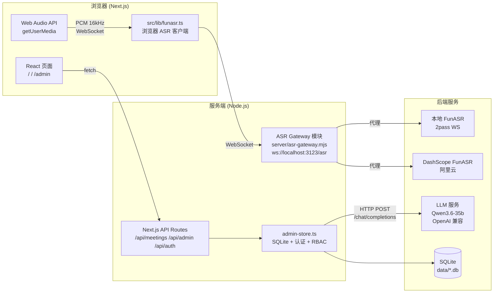

# 智能会议纪要系统

> [English](./README.md)

基于 Next.js 的全栈智能会议纪要系统，支持实时录音转写、LLM 纪要生成、邮件发送和后台配置管理。

---

## 功能特性

- **录音转写** — 浏览器端麦克风录音或音频文件上传，通过 ASR Gateway 统一接入 FunASR（本地部署或 DashScope 云端），支持说话人分离
- **纪要生成** — 基于 OpenAI 兼容 API（Qwen3.6-35b）自动生成结构化会议纪要，支持多模板、多版本
- **历史记录** — 会议记录列表，支持转写文本查看、纪要预览、重新生成
- **邮件发送** — 通过 SMTP 将会议纪要发送给指定收件人，支持抄送、自定义主题/签名，含发送审计日志
- **后台管理** — ASR 配置、LLM 配置、邮件配置、提示词模板管理、热词管理、用户与角色管理（RBAC）、审计日志

> 任务/行动项跟踪不属于当前产品范围。如后续需要，应作为独立产品开发，消费本系统输出的转写文本或会议纪要。

## 架构概览



## 技术栈

| 类别 | 技术 | 版本 | 说明 |
|:---|:---|:---|:---|
| 框架 | Next.js (App Router) | 14+ | 前端页面 + API Routes |
| 语言 | TypeScript | 5.x | 类型安全 |
| UI 框架 | Tailwind CSS | 3.x | 原子化 CSS |
| 数据库 | SQLite (`node:sqlite`) | built-in | 本地零依赖 |
| 状态管理 | Zustand | 4.x | 轻量级 |
| ASR 网关 | WebSocket (`ws`) | 8.x | 浏览器 ↔ ASR 中转 |
| 邮件 | Nodemailer | 9.x | SMTP 发送 |
| LLM | OpenAI 兼容 API | — | Qwen3.6-35b |

## 快速开始

### 1. 安装依赖

```bash
npm install
```

### 2. 启动开发服务

```bash
npm run dev
```

`npm run dev` 会同时启动：
- ASR Gateway: `server/asr-gateway.mjs`（挂载在 `/asr` 的 WebSocket 模块）
- Next.js: dev server (port 3123)

访问 http://localhost:3123 即可使用。

访问 http://localhost:3123/admin 进入后台管理。

### 3. 配置

所有敏感配置通过后台管理页面保存到本地 SQLite 数据库，**不会**暴露到前端代码中：

- **ASR 服务**: Provider 类型 (local_funasr / dashscope)、Endpoint 地址、API Key、Workspace ID
- **LLM 服务**: Base URL (OpenAI 兼容)、API Key、模型名称
- **邮件服务**: SMTP 主机/端口/用户名/密码、发件人名称、默认主题模板、默认签名
- **提示词模板**: 默认纪要模板（可自定义，支持 `{transcript}` 占位符）
- **热词**: ASR 热词列表，支持权重和启用/禁用

### 4. 默认账号

首次启动时自动创建引导管理员：

- 账号: `admin`（可通过 `BOOTSTRAP_ADMIN_ACCOUNT` 环境变量配置）
- 密码: `admin123`（生产环境请通过 `BOOTSTRAP_ADMIN_PASSWORD` 环境变量设置）

开发环境下可设置 `DEV_ACTOR_ACCOUNT` 跳过登录。

## 项目结构

```text
src/
├── app/
│   ├── page.tsx                 # 主页：录音、历史会议、转写和纪要
│   ├── layout.tsx               # 根布局
│   ├── login/                   # 登录页
│   ├── change-password/         # 修改密码页
│   ├── admin/
│   │   └── page.tsx             # 管理后台
│   └── api/
│       ├── config/              # 运行配置读取
│       ├── meetings/            # 会议 CRUD、ASR、LLM、邮件发送
│       ├── summarize/           # 兼容纪要生成接口
│       ├── admin/               # 后台配置管理（settings/hotwords/prompt-templates/users/roles/audit-logs/test-*）
│       └── auth/                # 登录/登出/会话
├── components/
│   ├── main/                    # 录音控件、设备选择、历史列表、转写视图、热词管理、Markdown 预览
│   └── layout/                  # AppHeader
├── lib/
│   ├── admin-store.ts           # SQLite 数据库操作、配置、会议、审计、极简 RBAC + 认证
│   ├── api-auth.ts              # 后台 API 角色守卫
│   ├── auth-constants.ts        # 会话 Cookie 常量
│   ├── funasr.ts                # 浏览器端 ASR 客户端 (WebSocket → ASR Gateway)
│   ├── voiceprint.ts            # 声纹特征提取与说话人聚类
│   ├── meeting-status.ts        # 会议状态枚举
│   ├── store-utils.ts           # 通用存储工具
│   └── mockData.ts              # 演示用模拟数据
└── types/
    └── index.ts                 # TypeScript 类型定义

server/
├── asr-gateway.mjs              # ASR Gateway (WebSocket 服务器，多 provider 适配)
└── runtime-store.mjs            # Gateway 读取运行配置 (SQLite)
```

## 数据存储

本地 SQLite 数据库文件位于：

```text
data/meeting-asr-app.db
```

包含以下核心表：`app_settings`、`llm_prompt_templates`、`asr_hotwords`、`meetings`、`meeting_asr_results`、`meeting_llm_results`、`meeting_send_records`、`asr_capture_sessions`、`users`、`roles`、`user_roles`、`audit_logs`、`auth_sessions`

## 核心流程

```text
录音/上传 → ASR Gateway → FunASR 转写 → LLM 纪要生成 → 邮件发送
```

### ASR Gateway 职责

ASR Gateway (`server/asr-gateway.mjs`) 是浏览器与 ASR 服务之间的统一代理层：

- 在同一应用服务的 `/asr` 路径接收浏览器 WebSocket 连接
- 根据 `app_settings.asr.provider` 配置自动选择 provider 适配器
- 支持 **Local FunASR**（2pass WebSocket 协议）和 **DashScope FunASR**（阿里云云端）
- 将所有 ASR 原始事件记录到 `asr_capture_sessions` 表，用于后续审计和排查
- 支持 Origin 白名单校验（默认 `localhost:3123`）
- WebSocket 握手必须携带有效登录 session Cookie；生产环境拒绝未认证、已过期、强制改密或无业务角色的连接
- 开发模式可使用 `DEV_ACTOR_ACCOUNT` 复用 HTTP API 的开发身份回退，不影响生产认证
- 音频流缓冲：在 ASR session 就绪前暂存 PCM 数据

### RBAC 角色

| 角色 | 权限 |
|:---|:---|
| `user` | 创建/查看会议、生成纪要、发送邮件 |
| `system_admin` | 所有权限 + 管理提示词模板、热词、ASR/LLM/邮件配置、用户与角色、审计日志、连接测试 |

### 声纹聚类

浏览器端 `voiceprint.ts` 实现说话人聚类：

- 从音频片段提取 12 维声纹特征（RMS、基频 F0、频谱质心/带宽/滚降/平坦度/通量）
- 基于自相关法计算 F0
- 使用 Web Audio API → 自实现 FFT（Cooley-Tukey）
- 余弦相似度 + 阈值聚类（默认相似度阈值 0.6）
- 作为 FunASR CAM++ 说话人标注的补充或本地降级方案

## 环境变量

| 变量 | 说明 | 默认 |
|:---|:---|:---|
| `PORT` | 统一应用服务监听端口 | `3123` |
| `APP_HOST` | 统一应用服务监听地址 | `0.0.0.0` |
| `ASR_GATEWAY_PATH` | ASR Gateway WebSocket 路径 | `/asr` |
| `ASR_GATEWAY_ALLOWED_ORIGINS` | 允许的 WebSocket 来源（逗号分隔） | `http://localhost:3123,...` |
| `BOOTSTRAP_ADMIN_ACCOUNT` | 引导管理员账号 | `admin` |
| `BOOTSTRAP_ADMIN_PASSWORD` | 引导管理员密码 | `admin123`（仅开发） |
| `DEV_ACTOR_ACCOUNT` | 开发环境自动登录账号 | — |

## NPM 脚本

| 命令 | 说明 |
|:---|:---|
| `npm run dev` | 启动统一的 Next.js + ASR 开发服务 |
| `npm run build` | 生产构建 |
| `npm start` | 启动统一的生产服务（port 3123） |
| `npm run lint` | 代码检查 |
| `npm run probe:service` | 检测 ASR 服务连通性（TCP/HTTP/WS） |

## 页面一览

| 路由 | 说明 |
|:---|:---|
| `/` | 主页面：设备选择、录音控制、实时转写、历史列表、纪要查看、邮件发送 |
| `/login` | 登录页 |
| `/change-password` | 修改密码页 |
| `/admin` | 管理后台：ASR/LLM/邮件配置、提示词模板、热词、用户与角色、审计日志 |

---

✌Bazinga！
