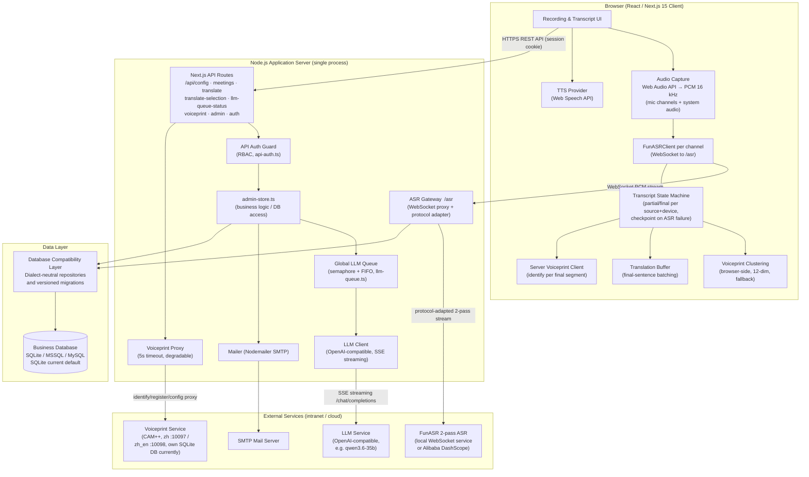
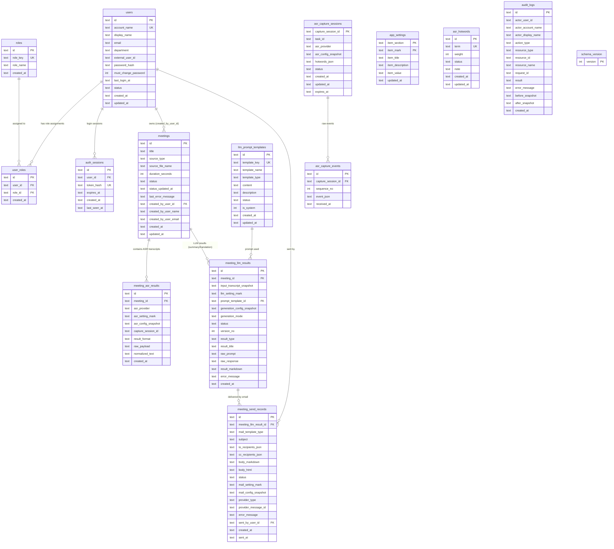
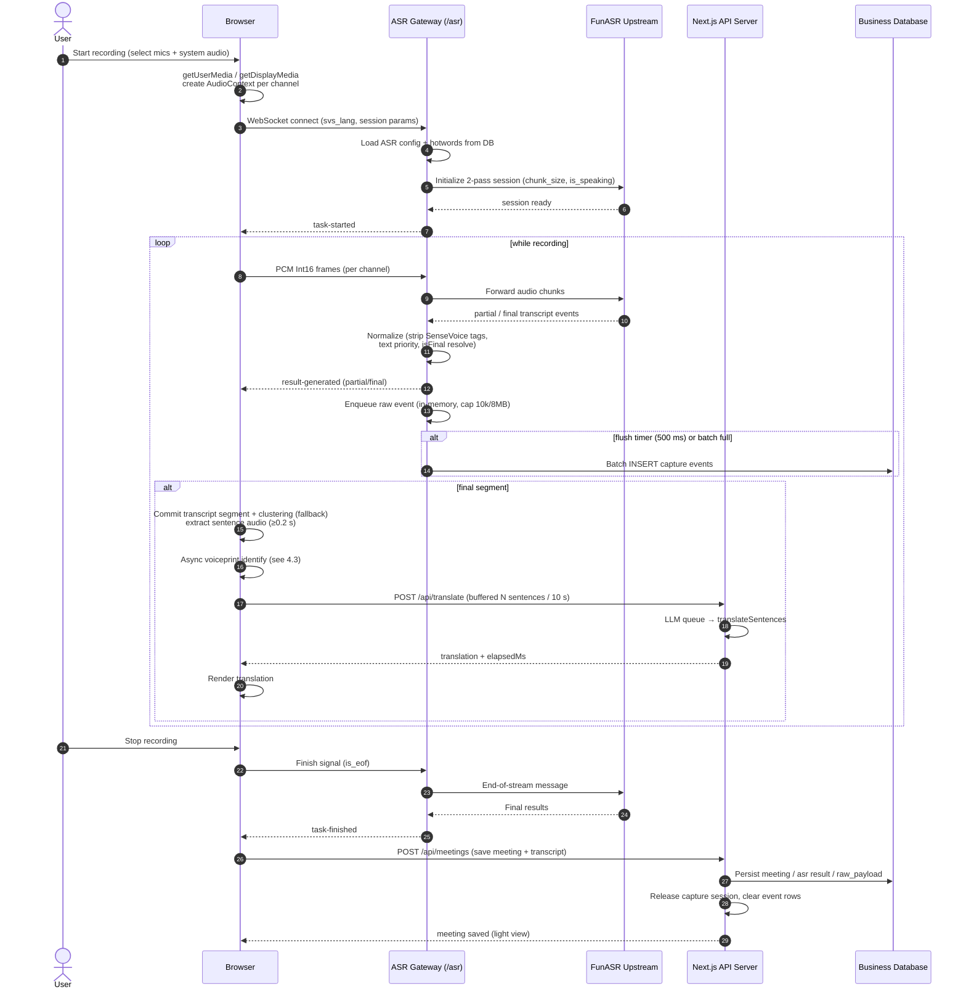
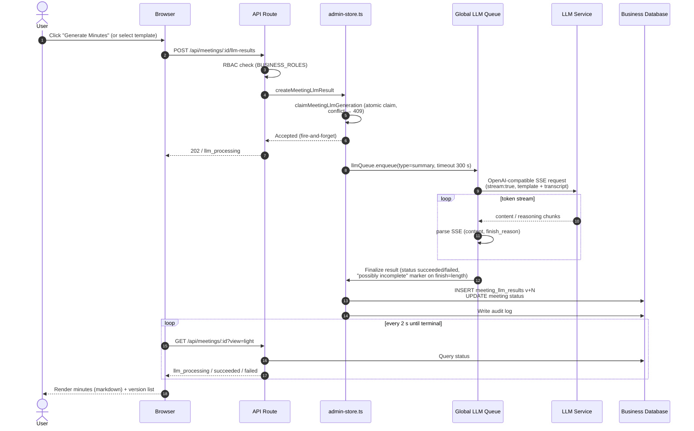
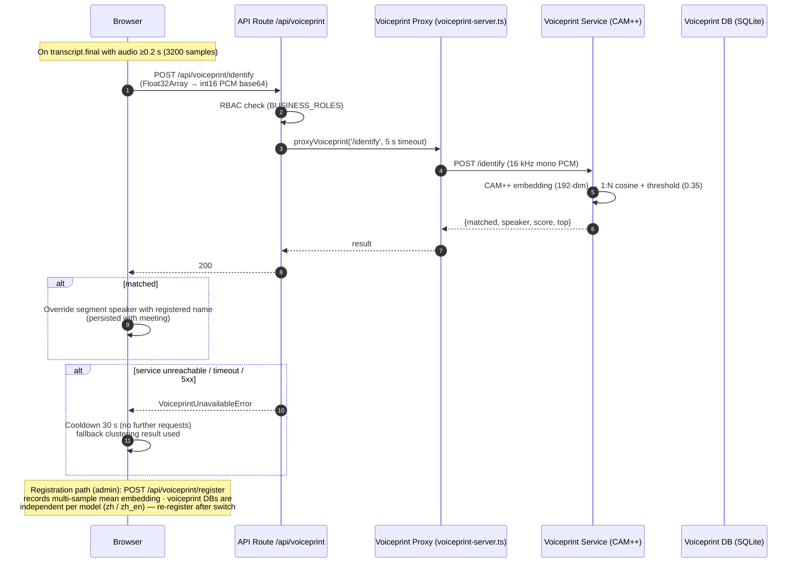
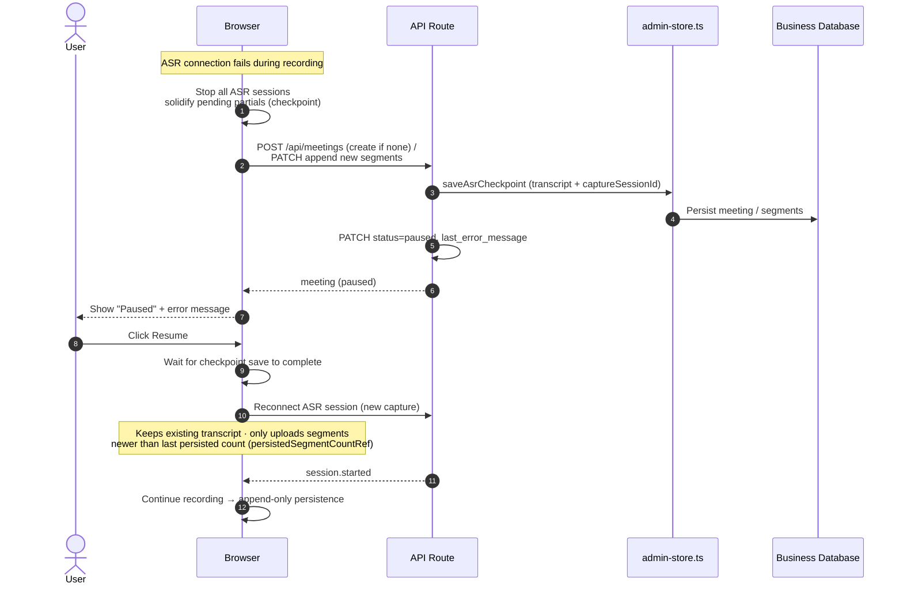
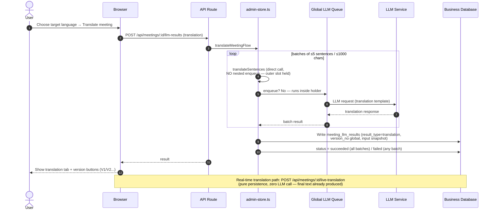
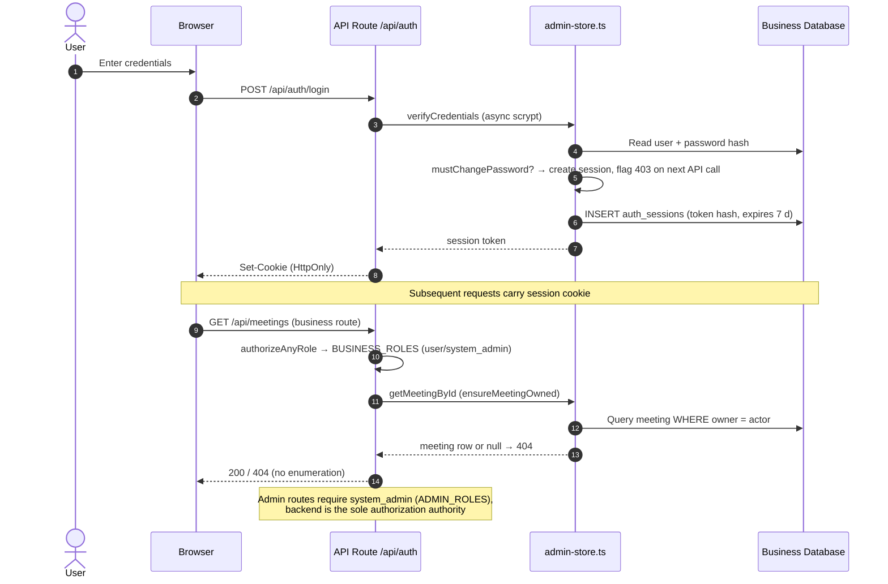

# AI Meeting Assistant — Technical Architecture Overview

> **Purpose**: Consolidated technical architecture for IT Headquarters approval.
> **Scope**: Functional overview, system architecture, data model, and data flows.
> **Project**: Smart Meeting Minutes System (Web-based ASR + LLM Meeting Assistant)
> **Status**: Core application implemented and deployed locally; database portability work is in progress.

---

## 1. Executive Summary

The **AI Meeting Assistant** is a web-based, self-hosted meeting intelligence platform. It captures meeting audio in the browser (microphone and/or system audio), streams it through an **ASR Gateway** to a **FunASR** speech recognition service (2-pass protocol) for real-time transcription, then uses an **OpenAI-compatible LLM** to automatically generate structured meeting minutes, provide real-time / historical / selection-based translation, and deliver results via email (SMTP).

The system is fully self-contained: a single Node.js application server (Next.js 15 custom server) serves the UI, API, WebSocket ASR gateway, relational database persistence, LLM queue, and mailer. The business data layer is being made portable across **SQLite, Microsoft SQL Server (MSSQL), and MySQL**. SQLite remains the default database for the current local deployment, while MSSQL and MySQL are compatibility targets for enterprise deployment.

### 1.1 Core Capabilities

| # | Capability | Description |
|---|-----------|-------------|
| 1 | Real-time ASR transcription | Streaming speech-to-text (partial + final segments), language selection (auto / zh / en / ja / ko / yue) |
| 2 | Dual-channel capture | Multiple microphones + system audio (`source`: `mic` / `speaker`), per-channel mute toggle during recording |
| 3 | Speaker identification | Two-tier: server-side CAM++ registration-based 1:N recognition (names) + browser-side feature clustering (fallback) |
| 4 | Audio file transcription | Upload audio/video files, transcribed through the same ASR pipeline into a meeting |
| 5 | LLM meeting minutes | Template-driven generation with multiple templates, versioned persistence (V1/V2/...) |
| 6 | Translation | Real-time (final-sentence batching), historical (meeting-level), and selection-based translation, versioned |
| 7 | Recording resilience | ASR-failure checkpoint auto-save (`paused` status) and resume with transcript preserved |
| 8 | English meeting support | Full pipeline: SenseVoice multilingual ASR + bilingual voiceprint + English prompt templates |
| 9 | Text-to-speech | Read transcripts / minutes / selection via Web Speech API |
| 10 | Email delivery | SMTP sending of minutes with send audit records |
| 11 | Admin console | RBAC user management, ASR/LLM/Mail configuration, prompt templates, ASR hotwords, voiceprint management, audit logs, connection tests |

> Task/action-item tracking is explicitly **out of scope**; it should be developed as a separate product consuming this system's transcripts or minutes.

### 1.2 Technology Stack

| Category | Technology | Version | Notes |
|---|---|---|---|
| Framework | Next.js (App Router) | 15 | Full-stack React; API Routes act as backend proxy |
| Language | TypeScript | 5.x | Type safety |
| UI | Tailwind CSS | 3.x | Atomic CSS |
| Database | Relational database compatibility layer | - | Supports SQLite, Microsoft SQL Server (MSSQL), and MySQL; SQLite is the current local default |
| State | Zustand | 4.x | Lightweight client state |
| ASR client | Custom `src/lib/funasr.ts` | - | Browser connects to ASR Gateway over WebSocket |
| Audio capture | Web Audio API (ScriptProcessorNode) | - | PCM 16 kHz mono extraction |
| ASR Gateway | WebSocket (`ws`) | 8.x | Browser ↔ upstream ASR relay/proxy |
| LLM | OpenAI-compatible API | - | Minutes / translation / tests share one endpoint |
| Mail | Nodemailer | 9.x | SMTP |
| TTS | Web Speech API | built-in | Browser-native |
| Voiceprint | Standalone Python service (stdlib HTTP + CAM++ `speech_campplus_sv_zh-cn_16k-common`) | separate container | Registration-based 1:N identification; zh container :10097 / zh_en :10098 |

---

## 2. System Architecture

### 2.1 Architecture Diagram

### 2.2 Module Description

**Browser client (Next.js)**
- Captures audio via `getUserMedia` / `getDisplayMedia`, extracts PCM 16 kHz Int16 with `ScriptProcessorNode`, and streams each channel over a dedicated WebSocket to the ASR Gateway.
- Maintains a per-channel transcript state machine (partial merge / final commit, throttled partial rendering); on ASR failure, solidifies pending partials and auto-saves the meeting as `paused`, with resume support that only appends new segments.
- Performs speaker handling on final segments in two tiers: (1) asynchronous server-side CAM++ identification (matched names override the segment speaker), (2) browser-side 12-dim voiceprint clustering as fallback (RMS, F0 autocorrelation, spectral centroid/bandwidth/rolloff/flatness/flux, self-implemented Cooley-Tukey FFT).
- Buffers final sentences and triggers batched translation; renders minutes/translations with versioning; supports per-channel microphone mute and audio file upload transcription.

**ASR Gateway (`server/asr-gateway.mjs`, path `/asr`)**
- Single relay point between browser and ASR upstream; reads ASR config + hotwords through the database compatibility layer on connect.
- Normalizes DashScope-style protocol to local FunASR 2-pass protocol (`mode:"2pass"`, `chunk_size`, `chunk_interval`, `is_speaking`, `is_eof`) and synthesizes `task-started` / `task-finished` / `result-generated` events for the frontend.
- Strips SenseVoice tags (`<|lang|><|emotion|><|event|>`); resolves result text priority `text → text_2pass → asr_result`; `isFinal = is_final || is_eof || offline mode`.
- Persists raw ASR events into capture sessions (in-memory queue + batched flush, see §4.3).
- Origin whitelist validation; production requires a valid login session for WebSocket handshake.

**Application Server / API Routes**
- `admin-store.ts` is the single business/DB layer: meetings, LLM results, translation flows, settings, users/roles, audit logs.
- All LLM calls pass through the **global LLM queue** (in-process semaphore + FIFO; concurrency and queue capacity configurable; timeouts: summary 300 s, translate/test 30 s).
- Secrets (`asr:api_key`, `llm:api_key`, `mail:smtp_password`) are server-only and never returned to the frontend.
- `/api/voiceprint/*` proxies to the standalone voiceprint container (5 s timeout; identify for any logged-in user, register/speakers/config for `system_admin`); on service unavailability the client falls back to clustering with a 30 s cooldown.

**Data Layer**
- Business persistence is accessed through a database compatibility layer targeting SQLite, Microsoft SQL Server (MSSQL), and MySQL.
- The current SQLite adapter uses one `DatabaseSync` connection, WAL journal mode, and `synchronous=FULL`; these are SQLite-specific optimizations and are not imposed on MSSQL/MySQL adapters.
- Schema evolution uses versioned migrations (`schema_version` + ordered `MIGRATIONS`) with database-specific DDL isolated behind the compatibility layer.

**Voiceprint Service (deploy/voiceprint, standalone container)**
- Python stdlib HTTP server (`voiceprint-server.py`) embedding CAM++ (`speech_campplus_sv_zh-cn_16k-common`, 192-dim), with an independent voiceprint database currently implemented with SQLite and WAL mode.
- Endpoints: `/health`, `/embedding`, `/register` (multi-sample mean, normalized), `/identify` (1:N cosine + threshold, default 0.35), `/speakers`, `/config`.
- Two containers: zh (port 10097) and zh_en bilingual (port 10098) — each with an independent voiceprint DB; model switch via admin console.

---

## 3. Data Model

The logical relational schema is defined in `server/database-schema.mjs`. It contains 14 business tables plus `schema_version` for migration bookkeeping. The current physical implementation is SQLite-oriented; the compatibility work will preserve this logical model while providing SQLite, MSSQL, and MySQL adapters and dialect-specific migrations.

### 3.1 Entity-Relationship Diagram

### 3.2 Table Purpose

| Table | Purpose |
|---|---|
| `app_settings` | Key-value configuration (ASR / LLM / Mail / queue / translation triggers / voiceprint) |
| `llm_prompt_templates` | Prompt templates (system template `tpl-translate` included) |
| `asr_hotwords` | ASR hotwords (boost terms) |
| `users` | Users (scrypt password hash, forced password change flag) |
| `roles` | Roles (`user`, `system_admin`) |
| `user_roles` | User-role association |
| `auth_sessions` | Login sessions (cookie, token hash, TTL 7 days) |
| `meetings` | Meeting master records (owner-bound via `created_by_user_id`) |
| `meeting_asr_results` | Meeting ASR transcripts (raw payload = structured session summary) |
| `meeting_llm_results` | Versioned LLM results (summary / translation; `UNIQUE(meeting_id, version_no)`) |
| `meeting_send_records` | Email send records (audit trail of deliveries) |
| `asr_capture_sessions` | ASR capture sessions (runtime, TTL-expired) |
| `asr_capture_events` | Raw ASR event stream (batched write, per-session sequencing) |
| `audit_logs` | Audit logs (30-day retention, auto-cleanup) |
| `schema_version` | Migration version bookkeeping (versioned schema evolution via ordered `MIGRATIONS`) |

### 3.3 Key Design Decisions

- **Zero-schema-migration for translations**: translations reuse `meeting_llm_results` with `result_type='translation'` and a globally incrementing `version_no`; `input_transcript_snapshot` stores the source text, `generation_config_snapshot` stores `{targetLang, source}`.
- **Schema evolution is versioned and database-neutral**: table structure changes must go through the `schema_version` + ordered `MIGRATIONS` mechanism. Migration execution, transactions, indexes, upserts, pagination, timestamps, and JSON/text handling must be mapped by the selected SQLite/MSSQL/MySQL adapter; changing only a SQLite `CREATE TABLE IF NOT EXISTS` statement is not sufficient for existing databases.
- **`summary` derivation**: the meeting summary sub-query always picks the newest `succeeded` result **excluding** `result_type='translation'` to prevent translations replacing minutes in list views.
- **`raw_payload` is a structured session summary** `{captureSessionId, taskId, status, asrProvider, eventStats, speakerIds, transcriptSegments}` — individual raw events are **not** retained (no display value; approved product decision).
- **Data isolation**: every meeting read/update/delete goes through `ensureMeetingOwned`; non-owners receive 404 (no resource enumeration).
- **Read-path layering**: `getMeetingById` (full, detail) vs `getMeetingLightById` (no transcript, used for polling/lists).

---

## 4. Data Flows

### 4.1 Real-time ASR Transcription Flow

### 4.2 LLM Minutes Generation Flow

### 4.3 Server-side Voiceprint Identification Flow

### 4.4 Recording Resilience (Checkpoint & Resume) Flow

### 4.5 Historical / Selection Translation Flow

### 4.6 Authentication & Authorization Flow

---

## 5. Security

| Area | Control |
|---|---|
| Authentication | Session-cookie based; passwords hashed with `scrypt` (async on interactive paths); 7-day session TTL; forced password change on first login / admin reset; reset invalidates all sessions |
| Authorization | RBAC: `user` / `system_admin`; backend-only enforcement; frontend role checks only hide entry points |
| Data isolation | Meetings strictly owner-bound (`created_by_user_id`); non-owners get 404; admins have **no** global meeting view |
| Secrets | API keys / SMTP password never returned to frontend; only non-sensitive config summaries exposed to regular users |
| WebSocket | Origin whitelist; production handshake requires valid session (rejects expired / forced-password-change / no-business-role) |
| Audit | `audit_logs` record who/what/when/result; 30-day retention with daily + startup cleanup; no content body in audit entries |
| Transport | HTTPS termination via reverse proxy (nginx, see `docs/nginx-meeting-asr.conf`) |
| LLM safety | Global queue prevents model saturation; queue capacity exceeded → fast reject ("LLM busy") |

---

## 6. Deployment

- **Single process**: unified HTTP + WebSocket server (`server/app-server.mjs`), custom Next.js server, default port `3123`.
- **Database compatibility**: business persistence targets SQLite, Microsoft SQL Server (MSSQL), and MySQL through a database compatibility layer. The current local deployment uses a SQLite file under `data/`; its single connection, WAL mode, and `synchronous=FULL` settings are SQLite-specific.
- **Docker**: `docker-compose.yml` bundles the app + optional local FunASR service (see `docs/funasr-deployment.md`, `docs/funasr-voiceprint-deployment.md`); the voiceprint service runs as independent containers (`deploy/voiceprint/`, zh :10097 / zh_en :10098).
- **Reverse proxy**: nginx config provided (`docs/nginx-meeting-asr.conf`) for HTTPS and multi-instance scaling.
- **ASR upstream options**: local FunASR 2-pass WebSocket (default, Paraformer / SenseVoice) or Alibaba Cloud DashScope (compatibility fallback), switchable at runtime via admin ASR config.

---

## 7. Known Boundaries & Future Direction

| Item | Status / Direction |
|---|---|
| Global LLM queue | In-process only; multi-instance deployment requires Redis-based coordination (not yet implemented) |
| Business database portability | Compatibility work in progress; the logical model must support SQLite, Microsoft SQL Server (MSSQL), and MySQL. SQLite is currently deployed locally; production adapter selection requires database-specific migration and integration validation |
| Service-side speaker recognition | Implemented (CAM++ standalone container). Constraints: must run as an isolated process (memory stability), ERES2NetV2 rejected (OOM), voiceprint DBs are independent per model — re-register after switching; audio is not persisted yet (future: audio persistence + offline re-identification) |
| English meetings | Supported end-to-end via SenseVoice multilingual ASR + bilingual CAM++ voiceprint + English prompt templates; the three layers can be enabled independently |
| Task/action-item tracking | Out of scope; separate product consuming this system's output |
| ASR event detail retention | Raw per-event details not persisted (memory stats summary only); replay capability would require separate design |
| Runtime config cache | In-process convention; multi-instance split requires a shared invalidation mechanism |

---

*Source documents (Chinese originals): `docs/technical-design.md`, `docs/design/` (asr-dual-channel, llm-generation-pipeline, llm-queue-and-translation, perf-and-storage, auth-permissions-and-tenant-isolation, funasr-voiceprint), `docs/auth-productization.md`, `docs/deployment-guide.md`.*
