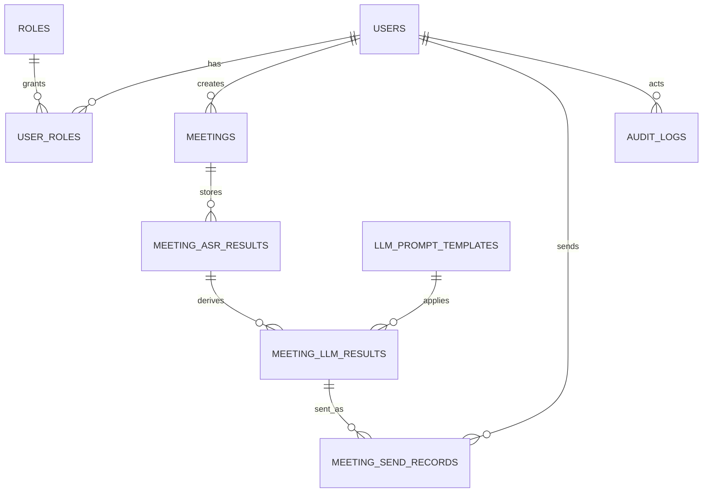

# 260724 Improve - Data Model

## 1. 目标

这份文档从数据建模角度收敛会议纪要系统的核心实体、实体关系、主键约束、运行时责任边界和一期实现范围。

目标是回答以下问题：

1. 系统有哪些核心业务对象。
2. 这些对象之间是什么关系。
3. 哪些是事实数据，哪些是衍生结果。
4. 哪些关系是一期必须落库的，哪些是后续扩展。

说明：

1. 本文只负责实体、关系、真相源和边界。
2. 字段级落库细节、约束和索引以 [数据库设计](./schema-design.md) 为准。

## 2. 建模原则

### 2.1 单一真相源

同一个运行期事实只允许一个真相源。

例如：

1. 当前 ASR 生效配置只存于 `app_settings` 的 `asr` 分组配置项。
2. 当前 LLM 生效配置只存于 `app_settings` 的 `llm` 分组配置项。
3. 当前默认提示词模板选择只存于 `app_settings` 的系统配置项，模板定义本身存于独立模板表。

### 2.2 事实与衍生分离

需要明确区分：

1. 会议本身是事实。
2. 原始 ASR 结果是事实采集结果。
3. LLM 清洗结果是基于原始转写的衍生产物。
4. 邮件发送记录是业务动作结果。

### 2.3 会议主链路最小化

会议主域收敛成四层：

1. `meetings`
   保存一次会议及其创建者快照。
2. `meeting_asr_results`
   保存这次会议对应的一份完整原始 ASR 结果。
3. `meeting_llm_results`
   保存基于某一条 ASR 结果、用不同模板产出的多份 LLM 清洗结果。
4. `meeting_send_records`
   保存某份 LLM 清洗结果被发送给谁、是否成功。

链路表达为：

`meeting -> asr_result -> llm_results -> send_records`

### 2.4 采集责任最短路径

原始 ASR 上游消息由离上游最近的代理采集，业务 API 负责持久化。

### 2.5 事务边界清晰

会议保存与默认 LLM 清洗分阶段处理：

1. 先提交会议和 ASR 结果。
2. 再触发默认模板对应的首份 LLM 清洗结果生成。

## 3. 核心实体清单

### 配置域

1. `app_settings`

### 身份与权限域

1. `users`
2. `roles`
3. `user_roles`

### 模板域

1. `llm_prompt_templates`

### 词表域

1. `asr_hotwords`

### 会议域

1. `meetings`
2. `meeting_asr_results`
3. `meeting_llm_results`
4. `meeting_send_records`

### 审计域

1. `audit_logs`

## 4. Mermaid 关系图

## 5. 各实体职责

### 5.1 `app_settings`

职责：

1. 保存当前生效的系统配置。
2. 承载 ASR、LLM、Mail、System 四类系统参数。

不负责：

1. 保存模板正文。
2. 保存会议业务数据。

### 5.2 `llm_prompt_templates`

职责：

1. 保存 LLM 清洗模板定义。
2. 作为可被 `meeting_llm_results` 引用的独立业务资源。

约束：

1. 模板仅允许管理员维护。
2. 被历史结果引用过的模板不应物理删除。

### 5.3 `asr_hotwords`

职责：

1. 保存管理员维护的热词表。
2. 作为运行时生成 FunASR 首帧 `hotwords` JSON 的数据来源。

约束：

1. 热词由管理员维护，不对普通用户开放编辑。
2. 每个热词都需要显式权重。
3. 运行时应只读取 `status = active` 的热词。

### 5.4 `meetings`

职责：

1. 保存会议主事实。
2. 保存创建者快照和会议自身状态。

不负责：

1. 直接保存原始 ASR 内容。
2. 直接保存 LLM 清洗正文。
3. 作为某次 LLM 结果或发送记录状态的唯一真相源。

### 5.5 `meeting_asr_results`

职责：

1. 保存原始 ASR 结果。
2. 保存使用时的 ASR 配置快照。
3. 作为 LLM 清洗的直接上游输入。

### 5.6 `meeting_llm_results`

职责：

1. 保存默认自动清洗和手动重生成的结果版本。
2. 同时绑定：
   - 来源 ASR 结果
   - 所用模板
   - 所用 LLM 配置快照

约束：

1. 直接上游外键是 `meeting_asr_result_id`。
2. 模板外键是 `prompt_template_id`。
3. 不再额外保存 `meeting_id` 作为主关系字段。

### 5.7 `meeting_send_records`

职责：

1. 保存邮件发送历史。
2. 保留发送时正文、收件人和邮件配置快照。

约束：

1. 直接上游外键是 `meeting_llm_result_id`。
2. 所属会议通过 `meeting_llm_result_id -> meeting_asr_result_id -> meeting_id` 回溯。
3. 不再单独保存 `meeting_id`。

### 5.8 `audit_logs`

职责：

1. 记录配置变更、模板维护、LLM 清洗、邮件发送等关键动作。

## 6. 一期必须落地的最小表集合

建议一期最小落地：

1. `app_settings`
2. `users`
3. `roles`
4. `user_roles`
5. `llm_prompt_templates`
6. `asr_hotwords`
7. `meetings`
8. `meeting_asr_results`
9. `meeting_llm_results`
10. `meeting_send_records`
11. `audit_logs`

## 7. 关键约束建议

### 7.1 配置约束

1. `app_settings` 以 `(item_section, item_mark)` 作为唯一业务键。
2. `item_section` 建议只允许：`asr`、`llm`、`mail`、`system`。

### 7.2 模板约束

1. `llm_prompt_templates.template_key` 建议唯一。
2. 默认模板应通过 `app_settings.system.default_prompt_template_id` 指向模板表主键。
3. 模板维护权限应限制为管理员。

### 7.3 热词约束

1. `asr_hotwords.term` 建议唯一。
2. `weight` 建议使用整数，并限制在合理范围内，例如 `1-100`。
3. 只对 `status = active` 的热词参与运行时拼装。
4. 运行时应将热词表拼成 FunASR 首帧所需的 JSON 字符串，而不是逐条发送。

### 7.4 ASR 与 LLM 结果约束

1. 一条 `meeting_asr_results` 可以有多条 `meeting_llm_results`。
2. 每条 `meeting_llm_results` 必须明确指向一条 `meeting_asr_results`。
3. 同一 `meeting_asr_result_id` 内 `version_no` 唯一。
4. 同一模板可产生多版结果，不要假定 `(meeting_asr_result_id, prompt_template_id)` 唯一。

### 7.5 会议与邮件约束

1. 一条邮件发送记录必须指向一个明确的 `meeting_llm_result_id`。
2. 邮件发送动作必须记录 `sent_by_user_id`。

### 7.6 `capture_session_id` 约束

1. 代理侧必须保证单次识别会话唯一。
2. API 读取后可保留一段 TTL，便于失败重试。
3. 代理暂存产物建议有过期清理机制。

## 8. 运行时映射关系

### 前端负责

1. 采集音频。
2. 展示实时转写。
3. 提交会议保存请求。
4. 触发 LLM 清洗与发邮件。

### 代理负责

1. 对接上游 ASR。
2. 采集原始上游事件。
3. 生成 `capture_session_id`。
4. 在连接首帧把热词表拼成 `hotwords` JSON 字符串传给 FunASR。
5. 保存短生命周期采集产物。

### Next API 负责

1. 读取激活配置。
2. 保存会议事实。
3. 持久化原始 ASR。
4. 基于 `meeting_asr_results` 生成 LLM 清洗结果。
5. 基于 `meeting_llm_results` 创建发送记录并发邮件。
6. 写审计日志。

## 9. 和其他文档的关系

1. [数据库设计](./schema-design.md)
   负责字段、约束、索引和 SQLite 落库细节。
2. [API 设计](./api-design.md)
   API 契约应以这里的实体边界为基础。
3. [会议状态机](./meeting-lifecycle.md)
   负责状态定义和流转，不负责字段级建模。
4. [邮件发送设计](./mail-delivery-design.md)
   负责发送流程和发送记录语义。
5. [权限与审计设计](./permission-and-audit.md)
   负责用户、角色和审计规则。
